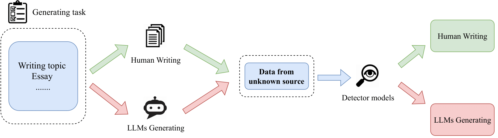
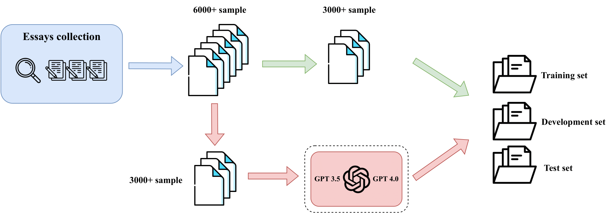

Vietnamese AI Generated Text Detection
=====

# ViDetect-Dataset

**ViDetect** dataset, a first benchmark Detect AI Generated Text dataset on Vietnamese.

## Overview

**ViDetect** dataset comprising 6.800 samples of Vietnamese essay, with 3.400 samples authored by humans and the remainder generated by LLMs, serving the purpose of detecting text generated by AI.

## Purpose
The goal of building the ViDetect dataset is to provide a benchmark for the task of classifying text created by AI in Vietnamese. Contribute to the development of natural language processing field in Vietnam.

## Key Features
- 6,800 paragraphs
- 3,400 human-written paragraphs
- 3,400 AI-generated paragraphs by rewriting human-written paragraphs

## Contributions
- Create the **ViDetect** dataset, a first benchmark Detect AI Generated Text dataset on Vietnamese.
- Conducting various experiments employing several state-of-the-art language models including ViT5, BARTpho, mDerbertav3, PhoBERT, and Bert-multilingual on the Vi-Detect AI Generated Text dataset.
- Undertaking a comprehensive analysis of the limitations and challenges encountered during the development of the ViDetect dataset, providing valuable insights to guide future research endeavors.

## Availability
This **ViDetect** dataset will be available for download after our article is accepted.

## Citation
If you are interested in the Videtect dataset and our paper, you can cite and read them here (preprint):
[Vietnamese AI Generated Text Detection](https://arxiv.org/abs/2405.03206)

## Authors
- Dan Quang Tran
  - Email: [21521917@gm.uit.edu.vn](mailto:21521917@gm.uit.edu.vn) ([tquangdan03@gmail.com](mailto:tquangdan03@gmail.com))

- Quan Van Nguyen
  - Email: [21521333@gm.uit.edu.vn](mailto:21521333@gm.uit.edu.vn)

- Huy Quang Pham
  - Email: [21522163@gm.uit.edu.vn](mailto:21522163@gm.uit.edu.vn)

- Thang Kien-Bao Nguyen
  - Email: [21521432@gm.uit.edu.vn](mailto:21521432@gm.uit.edu.vn)

- PhD Trong-Hop Do
  - Email: [hopdt@uit.edu.vn](mailto:hopdt@uit.edu.vn)

### Affiliations

- Faculty of Information Science and Engineering, University of Information Technology
- Vietnam National University, Ho Chi Minh City, Vietnam

## Contact

For any inquiries or feedback regarding the ViDetect dataset, please contact  [21521917@gm.uit.edu.vn](mailto:21521917@gm.uit.edu.vn) or [tquangdan03@gmail.com](mailto:tquangdan03@gmail.com).
